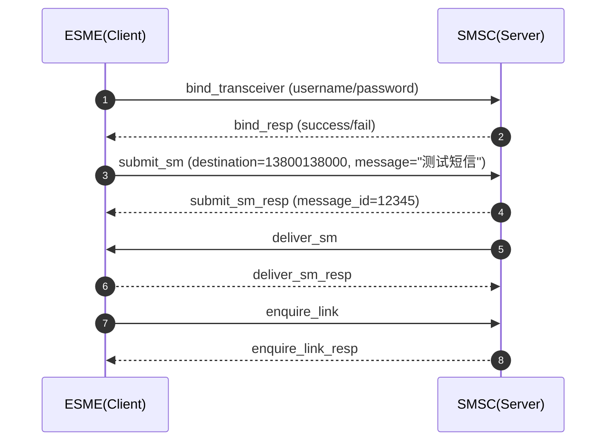

---

title: 短信协议
date: 2026-03-22 23:00:00 +0800

slug: short-message

description: "短信协议"

series: ["Linux与运维实践"]

tags: [Linux]

disable_first_line_indent: true

toc: true
---

## 短信类型

短信分为[OTP(One-time password)](https://en.wikipedia.org/wiki/One-time_password)与营销两类。

基于SMPP协议发送

## 协议
P2P  
A2P  
RCS

## SMPP

[SMPP(Short Message Peer to Peer)](https://en.wikipedia.org/wiki/Short_Message_Peer-to-Peer)
默认端口2775  
传输层基于TCP协议  
SMPP 3.4最常用，[SMPP 3.4官方文档](https://smpp.org/SMPP_v3_4_Issue1_2.pdf)

### 概念
#### MCC
MCC(Mobile Country Code)移动国家码，长度3位，用于标识“国家”，如中国：460
#### MNC
MNC（Mobile Network Code）移动网络码，用于与 MCC 组合唯一标识一个运营商网络，长度2~3位数字，如中国移动：460-00，460-01 → 中国联通，460-11 → 中国电信

路由策略
号码规范化

#### IMSI
IMSI(International Mobile Subscriber Identity)是移动通信系统中用来唯一标识每个用户SIM卡的号码。它主要用于核心网信令和路由
IMSI = MCC + MNC + MSIN

#### E.164
E.164 是国际电信联盟（ITU-T）制定的国际电话号码标准，用于保证全球电话系统中每个号码的唯一性和规范性。
E.164 号码由 最多 15 位数字组成，结构如下：

`+ [国家码] [国家内号码]`  
`+ 国际接入符（表示国际拨号）`  
国家码（Country Code, CC） 1–3 位数字，标识国家或地区，例如中国：86，美国：1  
国家内号码（National Significant Number, NSN） 1–12 位数字，包括区号和用户号码

在 SMPP 架构中，SMSC(Short Message Service Center)为短信中心(服务器端)用于短信存储、转发和管理(状态报告、路由状态)。ESME为外部短信实体(发送/接收短信的客户端),如(企业短信平台、应用服务器)。所有 SMPP 交互都是 PDU（Protocol Data Unit），SMPP异步消息 + 回执  

经典短信发送流程为bind → submit_sm → submit_sm_resp → deliver_sm


客户端ESME  
服务端SMSC  
ESME向SMSC发送bind_transmitter/bind_receiver/bind_transceiver登录建立连接
  - bind_transmitter：只能发
  - bind_receiver：只能收
  - bind_transceiver：收发一体（生产常用）
SMSC向ESME回复bind_resp表示连接建立

ESME向SMSC发送submit_sm，表示发送短信至服务端
SMSC向ESME回复submit_sm_resp接收确认
submit_sm（关键字段）
  - source_addr：发送方（企业号）
  - destination_addr：手机号
  - short_message：短信内容
  - data_coding：编码（ASCII/UCS2）
submit_sm_resp
- message_id（非常重要，用于回执）

状态回执
SMSC向ESME发送deliver_sm（DLR，状态报告）  
  - DELIVRD（成功）
  - UNDELIV（失败）
  - EXPIRED（过期）
ESME向SMSC回复deliver_sm_resp

长连接 + 心跳  
enquire_link  
enquire_link_resp

#### 路由
路由有直连、SIM、HQ、混合四种

#### SID
#### OA
#### DLR
#### CR
OTP回填率
#### pending
#### 短信签名
【】内的内容为短信签名

### 短信业务方向

MT（Mobile Terminated）下行  
MO（Mobile Originated）上行  
2-way(双向短信)，同时支持 MT + MO（可交互）  
长码 / 短码 / 虚拟号  
如：  
```
MT: 【招商银行】回复#XYZ调整信用卡额度至20000元  
MO: #XYZ
```

### TPS
TPS(Transactions Per Second)，表示系统每秒能处理多少条短信相关事务
通过配置TPS可以限制短信发送的速度
MT TPS（下发）
MO TPS（上行）

tcpdump SMPP抓包分析 
```bash
tcpdump -i any port 2775 -nn -s 0 -w smpp.pcap
指定短信通道IP，精准抓某个运营商通道问题
tcpdump -i eth0 host 1.2.3.4 and port 2775 -w smpp.pcap
```

依靠sequence_number，可以实现多个 submit_sm 可以不等响应
```
submit_sm #1
submit_sm #2
submit_sm #3
```

再批量返回
```
submit_sm_resp #2
submit_sm_resp #1
submit_sm_resp #3
```

编码
ASCII（英文）  
UCS2（中文，2字节）  
GSM 7-bit

UDHI长短信